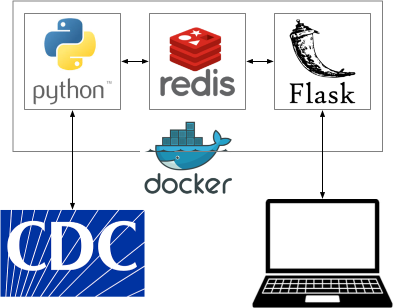

## Overview

The goal of this project is to demonstrate how to deploy a a simple application with three components:

1. A Python program using [`requests`](https://docs.python-requests.org/en/master/) to collect data.
2. The [redis](https://redis.io/) database to store data
3. A [Flask](https://flask.palletsprojects.com/en/2.0.x/) server launched via [gunicorn](https://gunicorn.org/) to server up the data.

The data used in this example is the current temperature in Bethlehem using data from the [WeatherAPI](https://www.weatherapi.com/).

The "application" modeled is intentionally minimal: Every 15 minutes, the collector obtains the current count and stores it in the redis database.  The Flask server has a single end point that allows a user to fetch this data.





## WeatherAPI Setup

To use this application you must [signup for a free WeatherAPI key](https://www.weatherapi.com/signup.aspx).

After you have signed up and confirmed your email, go to the [WeatherAPI Account page](https://www.weatherapi.com/my/) and copy your API key (near the top of the page).  To verify your API key, replace `<API_KEY>` in the following command:

```
curl "http://api.weatherapi.com/v1/current.json?q=18018&key=<API_KEY>"
```

If it succeeds, the output should be something like:

```
{"location":{"name":"Bethlehem","region":"Pennsylvania","country":"USA","lat":40.62,"lon":-75.41,"tz_id":"America/New_York","localtime_epoch":1710293264,"localtime":"2024-03-12 21:27"},"current":{"last_updated_epoch":1710292500,"last_updated":"2024-03-12 21:15","temp_c":12.2,"temp_f":54.0,"is_day":0,"condition":{"text":"Clear","icon":"//cdn.weatherapi.com/weather/64x64/night/113.png","code":1000},"wind_mph":5.6,"wind_kph":9.0,"wind_degree":240,"wind_dir":"WSW","pressure_mb":1010.0,"pressure_in":29.83,"precip_mm":0.0,"precip_in":0.0,"humidity":45,"cloud":0,"feelslike_c":11.7,"feelslike_f":53.1,"vis_km":16.0,"vis_miles":9.0,"uv":1.0,"gust_mph":9.4,"gust_kph":15.1}}
```


## AWS Deploy

We will deploy this system on an EC2 instance.  To deploy on AWS, we have to do following:

1. Install `git` and clone the repository

  ```
  sudo yum install -y git
  git clone https://github.com/cs220s24/dockerized_weather_app.git
  ```
  
2. Install docker, start it, and make it available to the `ec2-user`.  All steps are embedded in `aws_deploy.sh`

  ```
  cd dockerized_weather_app
  ./aws_deploy.sh
  ```
  
  NOTE:  After this step you need to log out and log back in to the EC2 instance.  The last step in the script is to add the `ec2-user` to the `docker` group so it can run `docker` commands, but the shell only reads group membership at login.
  
3.  We will mount `collector.env` as `.env` in the `collector` container and `server.env` as `.env` in the `server` container.  Make those files:

  Create `colector/collector.env` as:

  ```
  REDIS_HOST=redisdb
  REDIS_PORT=6379
  API_KEY=<api key>
  ```

  Create `server/server.env` as:

  ```
  REDIS_HOST=redisdb
  REDIS_PORT=6379
  ```
  
4. Build the container images.  These steps are embedded in `build.sh`

  ```
  ./build.sh
  ```
  
5. Launch the system.  There are three containers to start (`redis`, `collector`, and `server`), and all three need to be started in the same Docker network.  In addition, the `redis` container needs to mount a volume to ensure the `dump.rdb` file is saved, and the `collector` and `server` containers need to have their `.env` files mounted.  The `up` script contains all the necessary commands

  ```
  ./up
  ```


## Validation

If everything worked, you will be able to get the current temperature in Bethlehem by accessing the system.

  ```
  curl localhost
  ```
  
If this works, you can verify that your EC2 instance is configured correctly by connecting to the system using a web browser

  ```
  http://<EC2 IP address>
  ```
  
## Stop the System
  
  
If you need to stop the system, use the `down` script:
  
  ```
  ./down
  ```  
  
  
